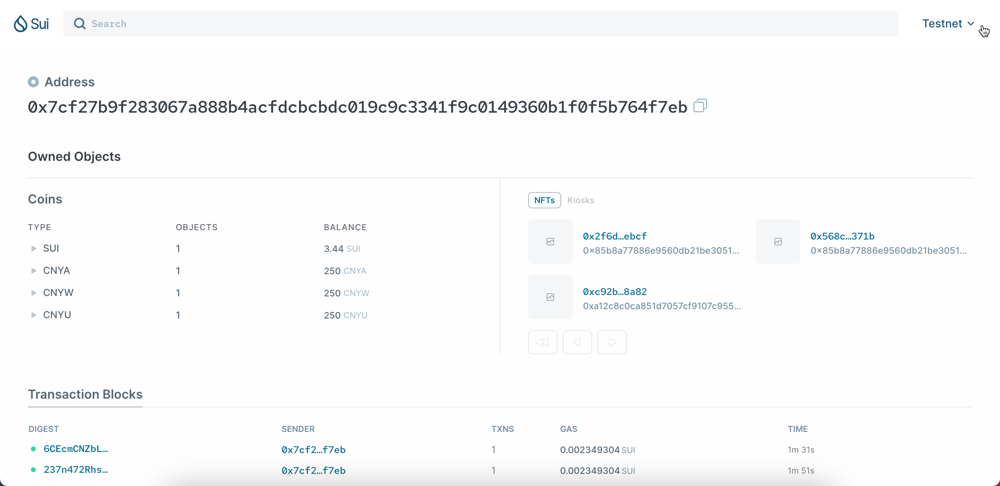
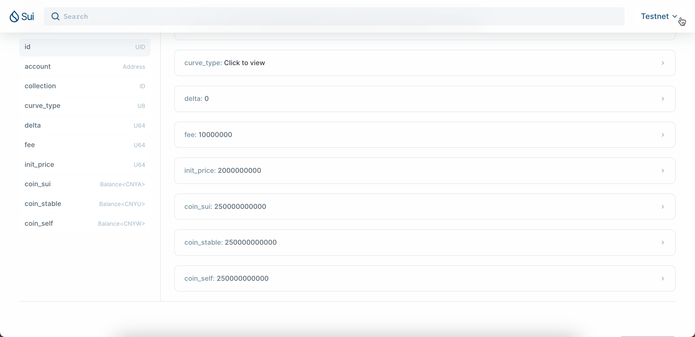

## Testing Cases

### Define the variables

Define the variables, below are real testing cases:

```shell
SWAPPKG="0x85b8a77886e9560db21be3051d04fd0c67df5d58edfb1862389ad69750e3c1c0"
CNYA="0x85b8a77886e9560db21be3051d04fd0c67df5d58edfb1862389ad69750e3c1c0::cnya::CNYA"
CNYACAP="0x066a6a6685d2d302fe6262c7c48ae0d0a3a6c8603279d613729e2a766e4af91e"
CNYU="0x85b8a77886e9560db21be3051d04fd0c67df5d58edfb1862389ad69750e3c1c0::cnyu::CNYU"
CNYUCAP="0xcb4d6be353349f63cba9d9ef7195b9826d5458723bbd51bff8b247914cd7dc87"
CNYW="0x85b8a77886e9560db21be3051d04fd0c67df5d58edfb1862389ad69750e3c1c0::cnyw::CNYW"
CNYWCAP="0xa32e547dd6c86b40413902c39eb8ff9a5224375e4d4f59b744e2437a0152aaac"
NFTTYPE="0x85b8a77886e9560db21be3051d04fd0c67df5d58edfb1862389ad69750e3c1c0::nft_driver::NFT"
```

### Mint Coins for Pocket Address

The test coins decimals are 9, which is following the same setup for SUI.

User can mint the test coins from [sui testnet explorer](https://suiexplorer.com/?network=testnet), below are steps:

1. Access the explorer, and query the package by copying the value of `SWAPPKG` defined at [Define the variables](README.md#define-the-variables).
   

2. Test Coin/NFT modules could be found at left bottom.
   

3. Choose `cnya`, the executable function `mint_coin` could be found at the right side.
   

4. Pass the parameter values:
   - Arg0: value of `CNYACAP` defined at [Define the variables](README.md#define-the-variables).
   - Arg1: Input the amount you want to mint

5. Click on `Execute` and `Approve` the signature.
   
   

6. Repeat 1-4 to mint `CNYU` and `CNYW`, please pay attention to pass the correct `Cap` value to corresponding Coin type.

Test Coins can be found from both Pocket and [sui testnet explorer](https://suiexplorer.com/?network=testnet)
   
   


### Mint NFT for Pocket Address

To mint a testing NFT, user can also do it via [sui testnet explorer](https://suiexplorer.com/?network=testnet)

1. Follow the step 1-2 at [Mint Coins for Pocket Address](README.md#mint-coins-for-pocket-address)

2. Choose module `nft_driver`, and expand the executable function `mint_to_sender`.
   

3. Pass the value to parameters:
   - Arg0: NFT Name
   - Arg1: NFT Description
   - Arg2: NFT URL, suggest to use `https://avatars.githubusercontent.com/u/12784118?v=4`, the picture looks like:
   

4. Click on `Execute` and `Approve` the signature.

5. The NFT ID will be displayed below the button `Execute`
   

### Create Kiosk

Call function `initialize_account` to create the `Kiosk`, which is collection of NFTs.

1. Follow the step 1-2 at [Mint Coins for Pocket Address](README.md#mint-coins-for-pocket-address)
2. Choose module `brickin`, and expand the executable function `generate_kiosk`.
3. Click on `Execute` and `Approve` the signature, no parameter required.
   
4. There would be three new objects created, user can find the kiosk information from the latest transaction in his/her pocket, the type must be `kisok`.
   

### Increase the balance

**Note: This is only for testing purpose to swap, just in case of not enough balance in the Pool.**<br/>

This testing case must be done after creating the trading pool from [Brickin Application](https://brickin-nft.vercel.app/).<br/>
The Coin ID could be found in [sui testnet explorer](https://suiexplorer.com/?network=testnet)


1. Mint `CNYA`, `CNYU`, `CNYW` for a certain amount, for example 2500000000000.
2. Follow the step 1-2 at [Mint Coins for Pocket Address](README.md#mint-coins-for-pocket-address)
3. Choose module `brickin`, and expand the executable function `increase_balance`.
4. Pass values to parameters:
   - Type0: value of `CNYA` defined at [Define the variables](README.md#define-the-variables).
   - Type1: value of `CNYU` defined at [Define the variables](README.md#define-the-variables).
   - Type2: value of `CNYW` defined at [Define the variables](README.md#define-the-variables).
   - Arg0: Pool ID created.
   - Arg1: One of IDs for Coin `CNYA`
   - Arg2: One of IDs for Coin `CNYU`
   - Arg3: One of IDs for Coin `CNYW`
   

After executing the function, the balances in trading pool for the three coins will be increased.


## Mapping: Deapp and sui contracts

Deapp URL: [Brickin Application](https://brickin-nft.vercel.app/).<br/>

### Create the Pool

Call function `create_pair_nft_trade_pool` to generate the Trading Pool, 4 type-args need to be passed:
- X, Y, Z: coin types held in the pool with balance, default the value X to `CNYA` and Y to `CNYU` for testing purpose.
- NFT: NFT type, default the value to `NFTTYPE`

Exact value of `CNYA`, `CNYU` and `NFTTYPE` could be found at [Define the variables](README.md#define-the-variables).

```rust
public entry fun create_pair_nft_trade_pool<X, Y, Z, T, NFT: key + store>(
        collection: &mut Kiosk,
        curve_type: vector<u8>,
        delta: u64,
        fee: u64,
        init_price: u64,
        nft: NFT,
        ctx: &mut TxContext,
    ) :ID
```

1. Click on `NFT Trade Pool`

   

2. Map `NFT` filed to `collection`, and `Coin` to type argument `Z`.

   

3. Confirm and Create the Pool

   

   Follow below mapping table to pass value to parameters:
   
| Page field         | Parameter    |
|:-------------------|:-------------|
| `Start Price`      | `init_price` |
| `Bonding Curve`    | `curve_type` |
| `Start Delta`      | `delta`      |
| `Pool Trading Fee` | `fee`        |
| `Add Items`        | `nft`        |